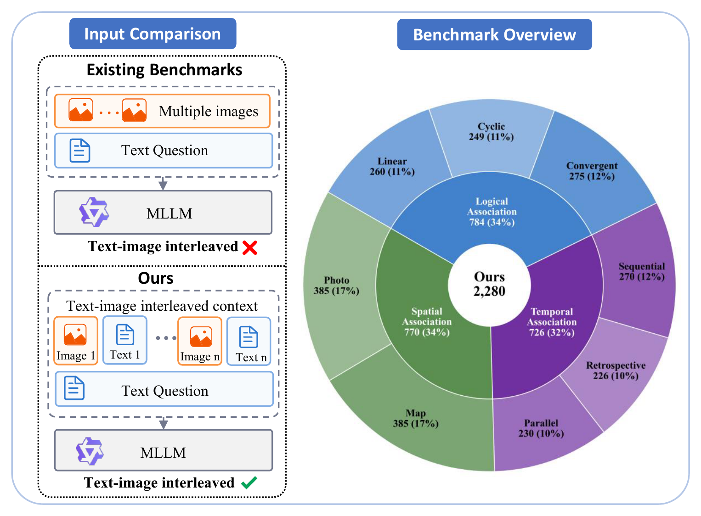
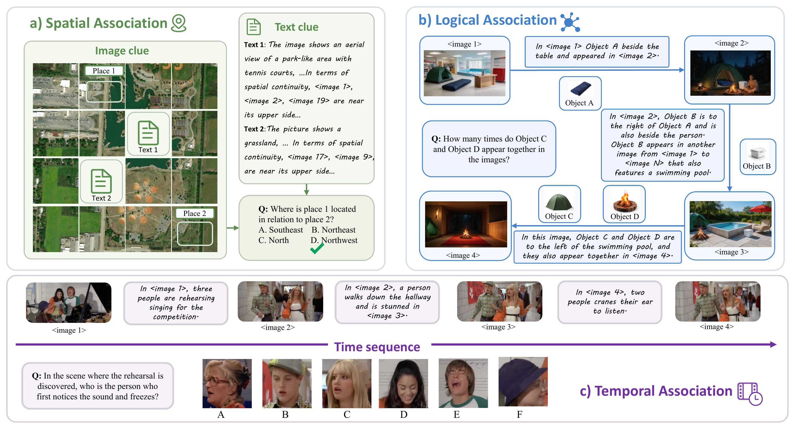

# TIC-Bench

<p align="center">
  <a href="https://arxiv.org/abs/2609.02573">
    
  </a>
  <a href="https://huggingface.co/datasets/pino10010/TIC-Bench">
    
  </a>
</p>

Official repository for **"Deeply Interleaved Text-Image Contexts for Multimodal LLMs Assessment."** This repository primarily provides inference and evaluation code for TIC-Bench.

<p align="center">
  
</p>

## Dataset

TIC-Bench evaluates multimodal large language models on deeply interleaved text-image contexts. It contains **2,280 questions** across three domains and eight task types:

- **Logical Association:** Linear, Cyclic, and Convergent Logic
- **Temporal Association:** Sequential, Retrospective, and Parallel Scenarios
- **Spatial Association:** Map and Photo reasoning

Logical and Spatial Association use multiple-choice questions. Temporal Association contains both multiple-choice and open-ended questions. The released dataset is identified as `pino10010/TIC-Bench` on Hugging Face.

<p align="center">
  
</p>

## Installation

Python 3.10 or later is required.

```bash
git clone YOUR_REPOSITORY
cd TIC-Bench
python -m pip install -e .
```

The included client uses the standard runtime configuration supported by the official OpenAI SDK. This repository does not store credentials or service endpoints.

## Dataset Layout

Each benchmark domain is organized into `question_*` directories:

```text
DATASET_ROOT/
├── question_0/
│   ├── question data
│   ├── referenced images
│   ├── answer_results_<model>.json
│   └── evaluation_results_<model>.json
├── question_1/
└── ...
```

The loader recognizes the following source files:

| Domain | Required question files | CLI kind |
| --- | --- | --- |
| Logical Association | `qa_pairs*.json`, `node_sequence*.json` | `visual` |
| Temporal Association | `qa_pairs*.json` with a top-level `qa` list | `temporal` |
| Spatial Association | `dataset_caption.jsonl` | `spatial` |

The `visual` name is retained internally for compatibility with the original Logical Association data layout.

## Quick Start

### 1. Run Model Inference

```bash
python -m ticbench ask DATASET_ROOT \
  --model MODEL_NAME \
  --kind spatial
```

Answers are written to:

```text
question_*/answer_results_<model>.json
```

Inference is resumable. Existing non-empty answers are preserved even if their historical status field is not `success`.

### 2. Run Three-Judge Evaluation

The evaluation pipeline requires three distinct judge model names and applies a 2-out-of-3 majority vote.

```bash
python -m ticbench evaluate DATASET_ROOT \
  --judge-model JUDGE_1 JUDGE_2 JUDGE_3 \
  --target TARGET_NAME \
  --kind temporal
```

`TARGET_NAME` is the portion of the answer filename between `answer_results_` and `.json`. For example:

```text
answer_results_example-model.json
               └─ TARGET_NAME = example-model
```

Evaluation results are written to:

```text
question_*/evaluation_results_<target>.json
```

Each result contains the three individual judgments and their aggregate fields:

- `correct` and `consistent`
- `score`
- `majority_vote`
- `judge_votes`
- `judge_results`
- `agreement_count`
- `unanimous`

If a judge call fails, completed judgments are retained. A later run requests only the missing judgments.

## Python Usage

All inference and evaluation functions accept injected model callers, so the benchmark logic can be used without the command-line interface.

```python
from pathlib import Path

from ticbench.inference import run_answers
from ticbench.openai_template import create_openai_caller

root = Path("DATASET_ROOT")
model = "MODEL_NAME"

summary = run_answers(
    root=root,
    model_name=model,
    caller=create_openai_caller(model),
    kind="spatial",
)

print(summary)
```

Three-judge evaluation can be called directly in the same way:

```python
from ticbench.evaluation import run_evaluation
from ticbench.openai_template import create_openai_caller

judges = {
    name: create_openai_caller(name)
    for name in ("JUDGE_1", "JUDGE_2", "JUDGE_3")
}

summary = run_evaluation(
    root=Path("DATASET_ROOT"),
    target="TARGET_NAME",
    judges=judges,
    kind="temporal",
)

print(summary)
```

## Code Structure

```text
ticbench/
├── cli.py                 # Command-line interface
├── questions.py           # Dataset loading and multimodal input assembly
├── inference.py           # Resumable answer generation
├── evaluation.py          # Three-judge evaluation and majority voting
├── io.py                  # Dataset detection and JSON utilities
└── openai_template.py     # Replaceable model-service template
```

## Citation

If you find TIC-Bench useful, please cite our paper:

```bibtex
@misc{wang2026deeplyinterleavedtextimagecontexts,
  title         = {Deeply Interleaved Text-Image Contexts for Multimodal LLMs Assessment},
  author        = {Zihao Wang and Xi Xiang and Yuwen Sun and Yingyu Li and Yabo Zhang and Yihan Zeng and Fan Li and Wangmeng Zuo},
  year          = {2026},
  eprint        = {2609.02573},
  archivePrefix = {arXiv},
  primaryClass  = {cs.CV},
  url           = {https://arxiv.org/abs/2609.02573}
}
```
